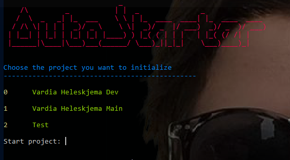

# SuperStarter
*The ultimate starter script for cool projects*

## About
Superstarter is a powershell script that allows you to perform task that you normally would have to do manually, automatically.

## How to

Clone the repository "git clone https://github.com/stengard/SuperStarter.git"

To use SuperStarter. Simply start the script in a powershell command window and write *.\SuperStarter.ps1*

You will be presented with a menu with choices. Select which project you want to use. The projects can be configured in the */config/config.json* file

## Contribute (guide for Alexander)

1. Create a new feature branch called "alex-feature" based on *master* and changes to it.
> git checkout -b alex-feature master
2. Start working to make your changes
3. Alex do some changes and adds one or several commits.
> git status  
  git add <some-file> (or .)  
  git commit  
3. This command pushes alex-feature to the central repository (origin), and the -u flag adds it as a remote tracking branch. After setting up the tracking branch, Alex can call git push without any parameters to push her feature.
> git push -u origin alex-feature
4. Alex has finished his changes. Before merging it into master, he needs to file a pull request letting the rest of the team know she's done. But first, he should make sure the central repository has her most recent commits:
> git push
6. First, whoever’s performing the merge needs to check out their master branch and make sure it’s up to date. Then, git pull origin alex-feature merges the central repository’s copy of alex-feature. You could also use a simple git merge alex-feature, but the command shown above makes sure you’re always pulling the most up-to-date version of the feature branch. Finally, the updated master needs to get pushed back to origin.
> git checkout master  
  git pull  
  git pull origin marys-feature  
  git push  
